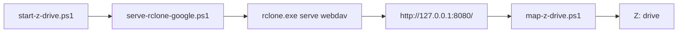

# Architecture

## Overview

This project uses a simple three-step stack:

## Components

### Runtime defaults and validation

`scripts\DriveMount-Rclone.common.ps1` is the source of truth for runtime defaults and shared validation.

It defines the project defaults for:

- `rclone-google:`
- `Z:`
- `127.0.0.1:8080`
- `http://localhost:8080/`
- `\\localhost@8080\DavWWWRoot`

It also provides shared checks for the WebDAV listener and mapped drive state.

### rclone remote

The project expects an existing rclone remote named `rclone-google:`.

That remote is machine-local configuration and is not stored in this repo.
The repo does not store Google credentials or an auth layer of its own.

### WebDAV serving layer

`serve-rclone-google.ps1` starts `rclone serve webdav` and exposes the remote on `127.0.0.1:8080`.

That localhost endpoint is the bridge between rclone and Windows drive mapping.

### Drive mapping

`map-z-drive.ps1` maps `Z:` to `http://localhost:8080/` through the Windows WebClient/WebDAV path.

`Z:` is the current documented V1 drive letter.

### Orchestration

`start-z-drive.ps1` is preferred because it coordinates the normal sequence in one place:

1. ensure WebDAV is running
2. wait for the endpoint to become available
3. map `Z:`
4. log what happened

This is preferred over half-manual sequencing because it reduces the chance of a missing step or mismatched state.

`bootstrap-z-drive.ps1` uses the same runtime defaults, but it adds prerequisite setup and optional first-run config handling.
If the remote is missing, bootstrap can open the local `rclone config` wizard on the operator machine.

## Why separate from app repos

This is machine infrastructure, not product code.

Keeping it separate avoids mixing:

- application domain files
- local automation
- machine-local auth state
- runtime logs

That separation makes later maintenance safer and keeps the project easier to reason about.
