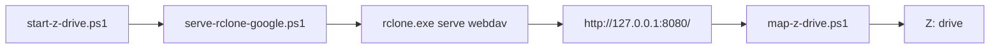

# Architecture

## Overview

This project uses a simple three-step stack:

## Components

### Runtime defaults and validation

`scripts\DriveMount-Rclone.common.ps1` is the source of truth for runtime defaults and shared validation.

It defines the project defaults for:

- `rclone-google:`
- `Z:`
- `127.0.0.1:8080`
- `http://localhost:8080/`
- `\\localhost@8080\DavWWWRoot`

It also provides shared checks for the WebDAV listener and mapped drive state.

### rclone remote

The project expects an existing rclone remote named `rclone-google:`.

That remote is machine-local configuration and is not stored in this repo.
The repo does not store Google credentials or an auth layer of its own.

### WebDAV serving layer

`serve-rclone-google.ps1` starts `rclone serve webdav` and exposes the remote on `127.0.0.1:8080`.

That localhost endpoint is the bridge between rclone and Windows drive mapping.

### Drive mapping

`map-z-drive.ps1` maps `Z:` to `http://localhost:8080/` through the Windows WebClient/WebDAV path.

`Z:` is the current documented V1 drive letter.

### Orchestration

`start-z-drive.ps1` is preferred because it coordinates the normal sequence in one place:

1. ensure WebDAV is running
2. wait for the endpoint to become available
3. map `Z:`
4. log what happened

This is preferred over half-manual sequencing because it reduces the chance of a missing step or mismatched state.

`bootstrap-z-drive.ps1` uses the same runtime defaults, but it adds prerequisite setup and optional first-run config handling.
If the remote is missing, bootstrap can open the local `rclone config` wizard on the operator machine.

## Why separate from app repos

This is machine infrastructure, not product code.

Keeping it separate avoids mixing:

- application domain files
- local automation
- machine-local auth state
- runtime logs

That separation makes later maintenance safer and keeps the project easier to reason about.

## Observed workload behavior

These are practical results from real copy-based tests on the mounted Google Drive path, not guarantees.
They are a better fit for this stack than synthetic local-disk benchmarks such as `fsutil`.

Observed large-file copy throughput:

- `1 MB`: `1.274 s`, `0.78 MB/s`
- `10 MB`: `0.227 s`, `44.08 MB/s`
- `50 MB`: `0.808 s`, `61.84 MB/s`
- `100 MB`: `1.57 s`, `63.69 MB/s`
- `200 MB`: `3.001 s`, `66.65 MB/s`
- `500 MB`: `8.232 s`, `60.74 MB/s`

Follow-up larger-file run:

- `500 MB`: `11.11 s`, `44.99 MB/s`
- `1 GB`: `16.57 s`, `61.79 MB/s`
- `1.5 GB`: `25.46 s`, `60.33 MB/s`
- `2 GB`: `35.13 s`, `58.29 MB/s`

Observed small-file behavior:

- `1000 x 64 KB` sequential copies: `57.269 s`, `1.09 MB/s`
- `800 x 64 KB` parallel copy with `4` jobs: `13.685 s`, `3.65 MB/s`

Practical interpretation:

- Large sequential copies are a good fit for this stack.
- Small-file workloads are a weak fit.
- Parallel small-file copy helps somewhat, but remains clearly slower than large-file transfer.
- Remote cleanup may complete before stale directory entries disappear from the mounted `Z:` view.

Recommended use cases:

- backups of larger files
- archives
- large document bundles
- larger media files

Less ideal use cases:

- workflows dominated by many very small files
- workflows that assume immediate delete visibility in the mounted folder view
